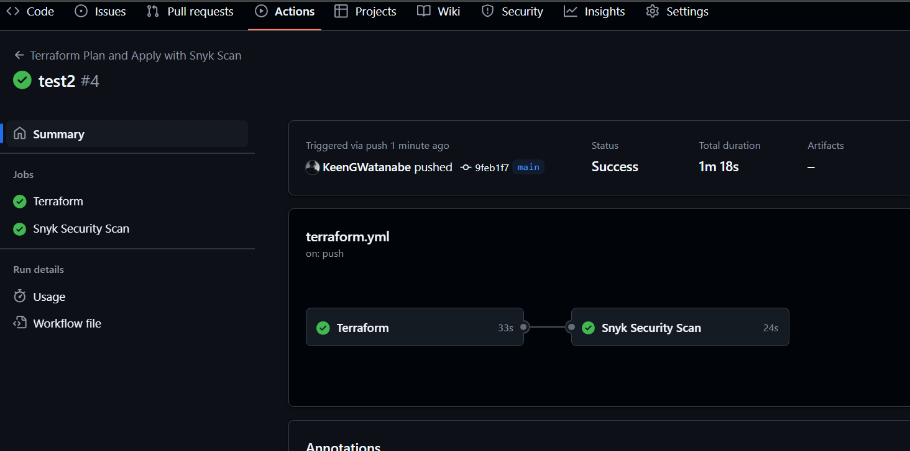

# m3.6 snyk
Create a brand new Github Repository and call it “3.6-snyk-scan” with a terraform .gitignore template.
Protect the main/master/default branch.
Add the following secrets to Github Actions Secrets & Variables:
AWS_ACCESS_KEY_ID, AWS_SECRET_ACCESS_KEY and SNYK_TOKEN
Create the necessary terraform configuration to achieve the below architecture:
Create a lambda function that prints out a “Hello, World!” line either in Python or NodeJS
Enhance the workflow file by referencing: https://github.com/luqmannnn/serverless-package-scan/blob/main/.github/workflows/ci.yaml 
Submit your repository with a working github actions workflow containing:
terraform-checks
snyk-checks (you can use some of the different snyk scans)
Ensure that both checks above are successful.

